# Create Smarter Messenger Experiences on Facebook with Bright Commerce Chatbot

## Introduction

## Pre-Requisites

The following subsections list the background knowledge and how to get started prior to creating a chatbot.

### JavaScript Knowledge

Basic Javascript knowledge on objects, conditional statements, and functions will be helpful in the implementation of Bright chatbot. Specific knowledge on Node.js is also used in this tutorial which acts as the server to handle communications between Bright and Facebook.

Browse the following resources below to learn more about the technologies used:
- JavaScript:  https://javascript.info/
- Basic Node.js: https://www.w3schools.com/nodejs/

### Git Knowledge

Git is a version control system that will be mainly used to update code used to build the chatbot. More information on Git can be found on https://git-scm.com/

We recommend versioning your code on a GitHub repository.

### Facebook Page
Creating a Facebook Page is a key step in your journey to creating a Messenger experience. Here are a few simple steps to help you get started:

1. Go to facebook.com/pages/create - it should lead you to a page shown below


2. Fill in your page information
3. Add images - adding a profile and cover image is important to allow others to identify your business

Congratulations! You have done the setup of your Facebook Business Page! Next is on how to create a Messenger Bot for your page!

### Optional: Add a “Send Message” Button
After creating your very own Facebook Page for your business, you will want a way to communicate with your customers. Before even going into the details on how to create a chatbot, what better way than to direct users to send messages to you when they visit your page?

This button should be found at the top of your page. Click on **Add a Button** and select the **Send Message** option.


### Optional: Create a Greeting

Customize your personal message to your customers when they first start communicating with your page through Messenger. So how do we go about doing it?

1. Go to your page’s General Settings and select **Messaging**
2. Scroll down and turn on **Show a greeting**
3. Customise your greeting and click **Change**

### Optional: Create Frequently Asked Questions and Responses

Create a set of creative responses for frequently asked questions regarding your business. This is highly recommended before creating your chatbot as it helps you brainstorm and implement various prompts for users to start interacting with your page on Messenger.

Here is how you can do it:

1. Under Manage Page, select **Inbox**
2. In the left menu sidebar, select **Automated Responses**
3. Enable **Frequently Asked Questions**
4. Click **Edit**
5. Add questions and responses (remember to save your responses with the **Save** button on the top right!)

### Connect your Webhook onto your Facebook for Developers App

These are the important few steps to getting started before you can develop your chatbot to serve your users using code.

#### Create an App on Facebook for Developers

1. Head to https://developers.facebook.com, click on **My Apps**
2. Click on **Create App**, located on the top right of the screen
3. Select **Manage Business Integration**
4. Enter your **App Display Name** and **App Purpose**
5. After creating the app, on the side bar, click on add products, leading you to the **Add Products** section on the main page. Find the **Messenger** product and click **Set Up**

Next, the following steps will be detailed in the next two sections. To summarise:

6. You will have to generate a page access token by adding a new page to the Messenger product, after clicking on the **Add or Remove Pages** button, select your Facebook page that you would like to add. After adding the page, you will be able to see a **Generate Token** button, which will give you a page access token that will be used on your Node.js for communication with Facebook via the Send API.
7. Set up a callback URL by entering your callback URL (location where your Node.js server is hosted) and also enter the verify token (which is a random string) that is determined by you in the Node.js server during the Node.js server setup. Lastly, click on **Verify and Save** to confirm your callback URL.
8. Now you’re ready to test the app, go to Messenger, and type a message to your Page. If your Node.js server (with the callback URL) receives a webhook event, you’ve successfully set up your app to receive messages!

#### Create the Webhook

Webhooks are API endpoints which you expose, to allow client(s) to connect to. This allows the users to interact to either send data or collect data from your servers. In this case, we are using this endpoint as an interaction between your webhook and your Facebook for Developers App, to send and receive data from our chatbot on your Facebook business page. 

1. Create a directory (folder), and navigate into it via the command line
2. Next, create an empty, `index.js` file in your project folder
3. Issue the command, `npm init` on the command line, accept default for all questions, and this will create `package.json` in your project folder automatically.
4. Issue the command, `npm install express body-parser --save`, this installs the Express.js http server framework module, and add them as dependencies in your `package.json` file
5. Create a server that listens for communication at the default port by adding the following code below into your `index.js` file

```js
'use strict';
 
// Imports dependencies and set up http server
const
  express = require('express'),
  bodyParser = require('body-parser'),
  app = express().use(bodyParser.json()), // creates express http server
  dotenv = require('dotenv');

dotenv.config();
 
// Sets server port and logs message on success
const listener = app.listen(process.env.PORT || 1337, () => console.log('webhook is listening on port ' + listener.address().port));
 
app.get('/', (req, res) => {
  res.status(200).send('You are connected to the chatbot application.');
})
```

6. Let us now create a `GET` request `/webhook` endpoint for your Facebook for Developers App to verify the webhook. We suggest adding your verification token in a `.env` file.

```js
// Adds support for GET requests to our webhook
app.get('/webhook', (req, res) => {
  
  // Your verify token. Should be a string you set.
  let VERIFY_TOKEN = process.env.VERIFY_TOKEN;
  
  // Parse the query params
  let mode = req.query['hub.mode'];
  let token = req.query['hub.verify_token'];
  let challenge = req.query['hub.challenge'];
  
  // Checks if a token and mode is in the query string of the request
  if (mode && token) {
    
    // Checks the mode and token sent is correct
    if (mode === 'subscribe' && token === VERIFY_TOKEN) {
      
      // Responds with the challenge token from the request
      console.log('WEBHOOK_VERIFIED');
      res.status(200).send(challenge);
      
    } else {
      // Responds with '403 Forbidden' if verify tokens do not match
      res.sendStatus(403);      
    }
  }
});
```

7. Finally, you can now test your webhook by issuing the curl command (replace the <VERIFY_TOKEN> with your own token that you had specified in the previous step:

```sh
curl -X GET "localhost:1337/webhook?hub.verify_token=<VERIFY_TOKEN>&hub.challenge=CHALLENGE_ACCEPTED&hub.mode=subscribe"
```

#### Hosting on Heroku

As the chatbot's callback URL requires a HTTPS endpoint, we recommend hosting the chatbot on Heroku. The guide on how to deploy can be found at https://devcenter.heroku.com/articles/getting-started-with-nodejs?singlepage=true

Next, to connect to a Git repository, you can utilise the GitHub integration in Heroku, which allows for automatic deployment whenever your `main` branch is updated https://devcenter.heroku.com/articles/github-integration

#### Link the Webhook with your Facebook for Developers App

So how can you connect with Facebook? 

1. Go to your Application that you have created earlier in https://developers.facebook.com
2. Select **Messenger** and click **Settings**
3. Insert your server’s **Callback URL**, followed by `/webhook`. In this tutorial the webhook endpoint is `https://<url>/webhook`. Note here that the URL has to be served with HTTPS, or else you would not be able to connect to Facebook

Note that the verify token is like a shared secret that Facebook has between you and your application for them to authenticate the connection to the callback URL. 

This is how it looks like if you have successfully added the webhook callback URL:


There you have it, you have successfully connected your chatbot application with Facebook!

## Sending and Receiving Messages

Sending messages require the use of Send API via a post request coupled with your page access token included in your URL query string.

Below is a wrapper function that takes in the sender’s identifier (called Page-scoped ID, or PSID in short) and the response object. This function converts parameters into the standardised data structure and proceeds to send the response.

```js
// Sends response messages via the Send API
function callSendAPI(sender_psid, response) {
 
  // Construct the message body
  let request_body = {
      messaging_type: 'RESPONSE',
      recipient: {
          id: sender_psid
      },
      message: response
  };
 
  // Send the HTTP request to the Messenger Platform
  request(
      {
        uri: "https://graph.facebook.com/v8.0/me/messages",
        qs: { access_token: process.env.PAGE_ACCESS_TOKEN },
        method: "POST",
        json: request_body
      },
      (err, res, body) => {
          if (!err) {
              console.log("Message sent!");
          } else {
              console.error("Unable to send message: " + err);
          }
      }
  );
}
```

In the `request_body`, the recipient’s ID is the sender of the messenger, which can be referenced by the PSID. This allows us to specify which user the message response is for, and for the Messenger Platform to route to the right user. The message attribute in the request_body simply refers to the response of the message that you will like to send back.

In order to make a HTTP request to the Messenger Platform, we will use the request package. More information on that package can be found here: https://www.npmjs.com/package/request.

The request object takes in 
- `uri`: The URI of the Send API
- `qs`: Query string parameters that will be attached to the URL
- `PAGE_ACCESS_TOKEN`
- `json`: Request body JSON that you had created

To get the `PAGE_ACCESS_TOKEN`, navigate to your App on Facebook for Developers. Under **Access Tokens**, click **Add or Remove Pages**. Add your page and click **Generate Token**. Read and check **I Understand**, then create a `.env` file and paste the token.

Your `.env` file should now look like this:
```
PAGE_ACCESS_TOKEN=<page_access_token>
VERIFY_TOKEN=<verify_token>
```

Create a `.gitignore` and add `.env` inside (if you have not). Also, add the variables to [Heroku](https://devcenter.heroku.com/articles/config-vars).  In our script, we the `dotenv` package is used to configure and retrieve the page access token. 

The start of your `index.js` should look like this (remember to add the new dependencies in `package.json` too):

```js
// Imports dependencies and set up http server
const
  express = require('express'),
  bodyParser = require('body-parser'),
  app = express().use(bodyParser.json()), // creates express http server
  dotenv = require('dotenv'),
  request = require('request');
 
dotenv.config();
```

Once all these components are in place, you’re ready to execute standard responses back to the sender. Let us try automating some standard responses!

We first define a wrapper function `sendMessage` that takes in `sender_psid` and `message` (of string type), converts the string to a response object, then sends the message. This function might seem unnecessary now, but is definitely useful when the scale of the chatbot gets larger.

```js
// Wrapper method to convert text message string to response object, and sends the message
function getResponseFromMessage(message) {
  const response = {
      text: message
  };

  return response;
}
```

### Receiving and Sending Back the Same Message
We will first start by responding to the same message as what the user sent.

```js
// Creates the endpoint for our webhook 
app.post('/webhook', (req, res) => {  
  
  let body = req.body;
  
  // Checks this is an event from a page subscription
  if (body.object === 'page') {
    
    // Iterates over each entry - there may be multiple if batched
    body.entry.forEach(function(entry) {
      
      // Gets the message. entry.messaging is an array, but 
      // will only ever contain one message, so we get index 0
      let webhook_event = entry.messaging[0];
      let sender_psid = webhook_event['sender']['id'];
      let message = webhook_event['message']['text'];
      console.log('Message received from sender ' + sender_psid + ' : ' + message);
      
      let response = getResponseFromMessage(message);
      callSendAPI(sender_psid, response);
    });
    
    // Returns a '200 OK' response to all requests
    res.status(200).send('EVENT_RECEIVED');
  } else {
    // Returns a '404 Not Found' if event is not from a page subscription
    res.sendStatus(404);
  }
  
});
```

Try it out! You should see the following behaviour:

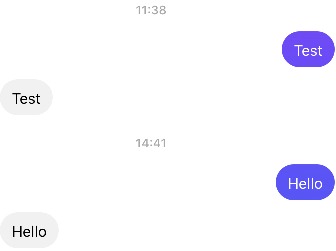

### Sending Standard Responses

Now let us implement some standard reponses. First, replace `sendMessage` with a new `processMessage` function that will be implemented.

The `processMessage` function encapsulates the implementation of the standard responses.

```js
function processMessage(message) {
  
  message = message.toLowerCase();

  let responses = {
    hi: "Hi there! Welcome to Bright. How can I help you?",
    bright: "Bright is a social enterprise where we provide vocational training to adults with intellectual disabilities.\n\n" +
        "We started a range of social enterprise projects to provide alternative work engagement opportunities for our adult trainees. " + 
        "Some of the projects began as therapy programmes which encourage the development of fine motor skills; others provide a realistic vocational training environment.\n\n" +
        "All net revenue earned from the sale of our products and services go towards paying a monthly allowance for our clients' work, as well as their lunch expenses while undergoing training.",
    proceeds:
        "All net revenue earned from the sale of our products and services go towards paying a monthly allowance for our clients' work, as well as their lunch expenses while undergoing training.",
    support:
        "We support adults with intellectual disabilities. We started a range of social enterprise projects to provide alternative work engagement for our adult trainees.",
    sell: "We sell craft and baker goods.\nLike our Facebook page http://fb.me/brightsocialsg to stay updated!",
    safe: "Our cookies are made by our clients in a clean and sanitised environment. The cookies are safe to consume before the expiry date that is printed on the packaging."
  };

  for (const key in responses) {
    if (message.includes(key)) {
      return getResponseFromMessage(responses[key]);
      break;
    }
  }

  // Message does not match any keyword, send default response
  return getResponseFromMessage("We could not understand your message. Kindly rephrase your message and send us again.");

}
```

Now, whenever your message includes any of those keywords in the `responses` object, a standard response message will be sent.

## Introduction to `Wit.ai` Natural Language Processing (NLP)

Wit.ai is a NLP service that provides a user-friendly interface to facilitate training your Facebook Messenger chatbot. Using its own NLP engine, Wit.ai is essentially used to build the “brain” of Bright chatbot.

### Creating a Customised `Wit.ai` Application

Sign in to Wit.ai using Facebook and click on **New App**. 


Let's name our application **BrightChatbot** and make its visibility **Private**. Click on **Create**. 

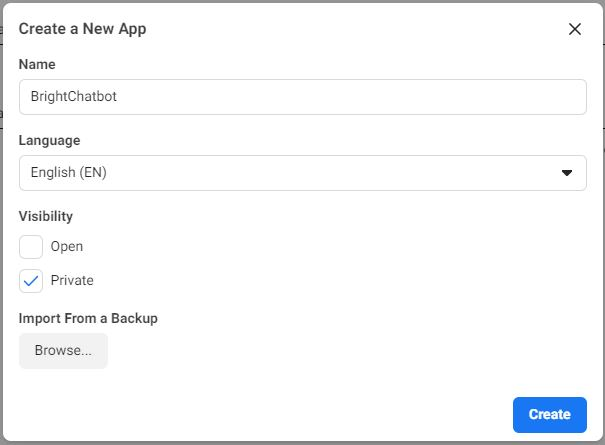

Congratulations, you’ve now made your first `Wit.ai` application. 


On the left side, you will see three tabs titled **Understanding**, **Management** and **Insights**. Let’s start by training out chatbot on the **Understanding** tab.

### Example of a Built-in Trait

Click the **Understanding** tab.  A sentence, such as a question to the chatbot, is known as an **utterance**. The intention behind this utterance is quite simply, the **intent**. 

`Wit.ai` has built-in entities that can be readily used for a number of common conversation topics. We often start off a conversation with a greeting and `Wit.ai` has a corresponding trait called `wit/greetings`. Traits are used to capture intents from the whole utterance.
Our `Wit.ai` application is pre-trained to identify a number common greetings. Whether you type “hello”, “hi” or even “aloha” in the Utterance section, the trait will be identified as `wit/greetings`.

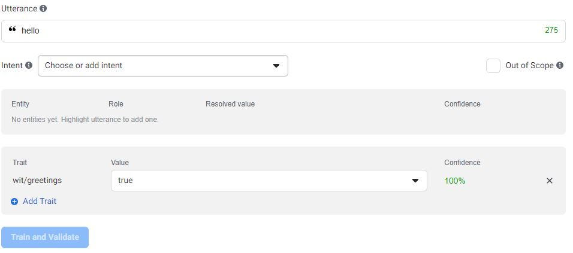

### Training the Model to Understand the Intent of a Message

Let’s train the chatbot to understand a generic question seeking a product recommendation.

In the Utterance tab, type the utterance “I want to buy something”. Click the **Choose or add intent** drop-down list and create new intent **recommendation**.

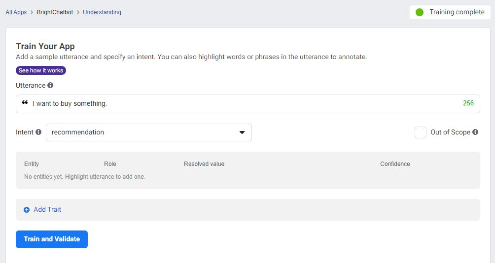

Click **Train and Validate**.
- You will see **Training scheduled** followed by **Training ongoing** on the top right-hand corner as `Wit.ai` trains to identify the recommendation intent from your sentence
- **Training complete** is shown when the training is finished


During the training process, there is no need to wait for the previous utterance’s training to complete before training new utterances. You can keep training new utterances back-to-back as the training process for each utterance can run in parallel on `Wit.ai`.

### Training the Model to Understand the Entity in a Message

What if instead of a general recommendation, the buyer wants to specifically buy a type of product such as cookies? We classify **cookies** as `baker` type products and would need the chatbot to recognise **cookies** as the **product_type** entity.

Set utterance as “What types of cookies do you have?”
The intent is `recommendation` by default as that’s the only intent we have trained so far.

To identify the intent, highlight "cookies":


Create the entity **product_type**. The entity is now shown prior to training. For more complicated sentences with multiple entities, you can highlight and label them one by one.

Change the **Resolved value** to `baker` as we want the cookies to be identified as being in the baker category.

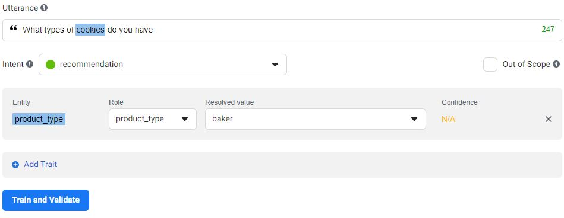

Now **Train and Validate**. The chatbot’s learning is not limited to only the utterances shared through **Understand**. The model itself will be able to infer additional ways the same question or utterance can be asked based on the few examples provided by you. 

### Adding more Training Data

Let’s train the chatbot to understand more utterances and intents to help it better understand future queries. Train it with the following:

| Sentence | Intent |
| --- | --- |
| **How do I know if they are safe to consume?** | `enquiry_general` |
| I need help | `enquiry_general` |
| **When is delivery coming?** | `enquiry_delivery` |
| **When is my order arriving?** | `enquiry_delivery` |
| What kind of cookies do you have? | `recommendation` |
| Can you send me the list of products here to choose? | `recommendation` |

We have added in a few more `recommendation` intents as well, to help the model further differentiate between the three unique entities.

### Making Changes in the Management Tab

Oops, we forgot to add entities to the sentences in bold in the table we used for training earlier! Let’s add the entities using the **Management** tab. 

Click on **Management**, then **Utterances**. 

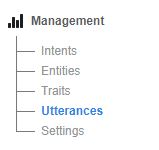

Find the sentence “How do I know if they are safe to consume” that you have previously trained the chatbot with and click on the down arrow beside it.


You can now add entities to it! Highlight the word "safe" and add an entity called `safety`.

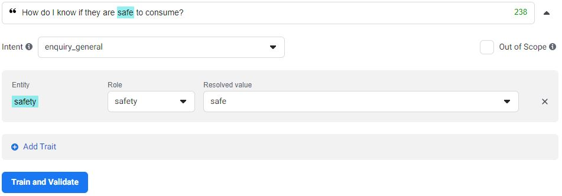

Now, train!

That’s really all there is to training your chatbot and managing it on Wit.ai

Deletions of any intents, entities and utterances can be handled in the management tab and their respective sections.

Before we conclude with a test of our training’s accuracy, update the entities for the following two sentences that we have previously trained:
- When is my delivery coming?
- When is my order arriving?

Set their entities to `estimated_arrival` for the text "when".

### Evaluating Performance

Test your chatbot and see whether it can correctly identify the intents for these questions?

| Utterance | Actual Intent |
| --- | --- |
| What would you suggest? | `recommendation` |
| When will my order be here? | `enquiry_delivery` |

In this scenario, it should be a success! However, it is completely all right if the model does not recognise all of the intents correctly. In machine learning, the model will only work well with lots and lots of training. Therefore, do remember to train the model with these new data!

### Connecting the Custom `Wit.ai` Model to your Facebook for Developers App

You can now connect your `Wit.ai` model to your Facebook for Developers App! You can either use the Messenger Settings or Graph API to do so. The steps to connect the model to your application can be found at https://developers.facebook.com/docs/messenger-platform/built-in-nlp#customizing_nlp

## Processing Messages with NLP

Now we are ready to use your `Wit.ai` model (NLP model) outputs to process messages! Let us first understand how this works. When a user interacts with Bright, the message will first be sent to the NLP model. The outputs of the model will be sent in the message webhook and can be retrieved in the `nlp` key in the `message` object.

We will now train the messages that we have handled with the standard responses in the NLP model. All of the messages are of the same intent `enquiry_general`, but the entities of the general enquiry are different, which allows us to differentiate between the queries the user has.

| Sentence | Intent | Phrase -> Entity |
| --- | --- | --- |
| Who is Bright? | `enquiry_general` | Bright -> `organisation` |
| Where does your proceeds go to? | `enquiry_general` | proceeds -> `profit` |
| Who makes the products? | `enquiry_general` | Who makes -> `manufacturer` |
| What do you sell? | `enquiry_general` | sell -> `products` |
| How do I know if they are safe to consume? | `enquiry_general` | safe -> `safety` |

Let us modify our post request function to retrieve the NLP model output and pass it in as a new, second argument in `processMessage`.

```js
console.log('Message received from sender ' + sender_psid + ' : ' + message);

let nlp = webhook_event['message']['nlp'];

let response = processMessage(message, nlp);
callSendAPI(sender_psid, response);
```

Let us first wrap the default message in a new `getDefaultResponse` function, which will be used in early returns.

```
function getDefaultResponse() {
  return getResponseFromMessage("We could not understand your message. Kindly rephrase your message and send us again.");
}
```

We will then modify the processMessage function, and abstracting the general enquiry handling into another function `handleGeneralEnquiry`.

```js
// Processes and sends text message
function processMessage(message, nlp) {
  
  if (nlp['intents'].length === 0) {
    
    // Check if greeting
    let traits = nlp['traits'];

    if (traits['wit$greetings'] && traits['wit$greetings'][0]['value'] === 'true') {
      console.log('Is greeting');
      return getResponseFromMessage('Hi there! Welcome to Bright. How can I help you?');
    }
    
    console.log('Returning default response');
    return getDefaultResponse();
  }

  console.log('Intents inferred from NLP model: ')
  console.table(nlp['intents']);

  // Get the intent with the highest confidence
  let intent = nlp['intents'][0]['name']
  let confidence = nlp['intents'][0]['confidence']

  // If confidence of intent is less than threshold, do not process
  if (confidence < 0.7) return getDefaultResponse();

  switch (intent) {
    case 'enquiry_general':
      let entities = nlp['entities'];

      // Get entity with highest confidence
      let entity = null;
      let highest_confidence = 0;
      for (const e in entities) {
        let confidence = entities[e][0]['confidence'];
        if (confidence > highest_confidence) {
          highest_confidence = confidence;
          entity = entities[e][0]['name'];
        }
      }

      console.log('Entity with highest confidence: ' + entity);

      return handleGeneralEnquiry(entity);
    default:
      return getDefaultResponse();
  }

}
```

We set a arbitrary confidence threshold of 0.7 in order to prevent handling of messages with low confidence.

```js
function handleGeneralEnquiry(entity) {

  if (entity == null) return getDefaultResponse();

  let responses = {
    organisation: "Bright is a social enterprise where we provide vocational training to adults with intellectual disabilities.\n\n" +
        "We started a range of social enterprise projects to provide alternative work engagement opportunities for our adult trainees. " + 
        "Some of the projects began as therapy programmes which encourage the development of fine motor skills; others provide a realistic vocational training environment.\n\n" +
        "All net revenue earned from the sale of our products and services go towards paying a monthly allowance for our clients' work, as well as their lunch expenses while undergoing training.",
    profit:
        "All net revenue earned from the sale of our products and services go towards paying a monthly allowance for our clients' work, as well as their lunch expenses while undergoing training.",
    manufacturer:
        "We support adults with intellectual disabilities. We started a range of social enterprise projects to provide alternative work engagement for our adult trainees.",
    products: "We sell craft and baker goods.\nLike our Facebook page http://fb.me/brightsocialsg to stay updated!",
    safety: "Our cookies are made by our clients in a clean and sanitised environment. The cookies are safe to consume before the expiry date that is printed on the packaging."
  };
  
  return getResponseFromMessage(responses[entity]);
}
```

Also, notice how the greeting is handled differently? By utilising `Wit.ai`'s built-in `greetings` trait, we are able to leverage on the detection based on pretrained data, which means that we do not have to train greetings like "Hi" ourselves!

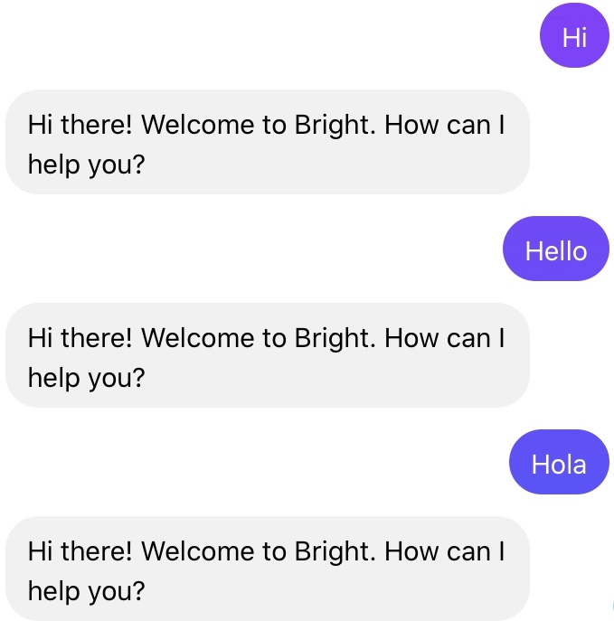

## Creating a Business Database

```js
// Sets server port and logs message on success
const listener = app.listen(process.env.PORT || 1337, () => console.log('webhook is listening on port ' + listener.address().port));

/*
  Mock data in database (remove if database is implemented)
*/
let products = [
  {
    pid: 123,
    title: 'Chocolate Chip Cookies',
    pattern: 'Box of 6',
    price: 15.5,
    image_link: 'https://github.com/ngrq123/bright-chatbot-tutorial/blob/main/images/chocolate_chip_cookies.jpg'
  },
  {
    pid: 456,
    title: 'Earl Grey Sunflower Seeds Cookies',
    pattern: 'Box of 9',
    price: 18.5,
    image_link: 'https://github.com/ngrq123/bright-chatbot-tutorial/blob/main/images/earl_grey_sunflower_seeds_cookies.jpg'
  }
]

let cart = [
  {
    pid: 123,
    title: 'Chocolate Chip Cookies',
    pattern: 'Box of 6',
    price: 15.5,
    quantity: 1,
    image_link: 'https://github.com/ngrq123/bright-chatbot-tutorial/blob/main/images/chocolate_chip_cookies.jpg'
  },
  {
    pid: 456,
    title: 'Earl Grey Sunflower Seeds Cookies',
    pattern: 'Box of 9',
    price: 18.5,
    quantity: 2,
    image_link: 'https://github.com/ngrq123/bright-chatbot-tutorial/blob/main/images/earl_grey_sunflower_seeds_cookies.jpg'
  }
]

let order = [
  {
    pid: 123,
    title: 'Chocolate Chip Cookies',
    pattern: 'Box of 6',
    price: 15.5,
    quantity: 1,
    image_link: 'https://github.com/ngrq123/bright-chatbot-tutorial/blob/main/images/chocolate_chip_cookies.jpg'
  },
  {
    pid: 456,
    title: 'Earl Grey Sunflower Seeds Cookies',
    pattern: 'Box of 9',
    price: 18.5,
    quantity: 2,
    image_link: 'https://github.com/ngrq123/bright-chatbot-tutorial/blob/main/images/earl_grey_sunflower_seeds_cookies.jpg'
  }
]
/*
  End of mock data in database (remove if database is implemented)
*/
```

## Solution Overview

The simplified technology stack as follows:

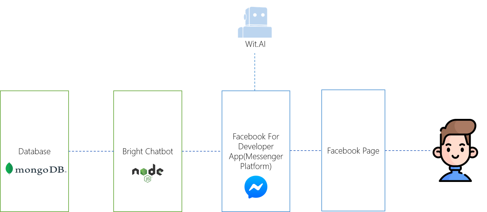

## Listing Products

### Introduction to Templates

[Templates](https://developers.facebook.com/docs/messenger-platform/send-messages/templates) offer a richer experience for users by adding more ways to interact with the chatbot.

The template that we will use is the carousel of generic template, which consists of a list of elements. To do so, we create a new function `generateCarouselofProductsResponse` that takes in a list of products and converts to a response with a `template` attachment.

```js
function generateCarouselOfProductsResponse(products) {
  
  return {
    "attachment": {
      "type": "template",
      "payload": {
        "template_type": "generic",
        "elements":
        products.map(p => {
          let subtitle = '$' + p['price'].toFixed(2);
          if (p['pattern']) {
            subtitle = '(' + p['pattern'] + ') ' + subtitle;
          }

          return {
            title: p['title'],
            subtitle: subtitle,
            image_url: p['image_link'],
            buttons: [
              {
                type: "postback",
                title: "Learn more",
                payload: `enquiry_product ${p['title']}`
              }, 
              {
                type: "postback",
                title: `Add to cart`,
                payload: `cart_add ${p['pid']}`
              }
            ]
          }
        })
      }
    }
  }

}
```

Notice that other than textual information, we have included **Learn More** and **Add to Cart** buttons. **Postbacks** are unlike normal messages, as they carry a `payload` property. More on postback will be discussed later.

### Updating `processMessage`

Previously, we have trained the sentence "Can you send me the list of products here to choose?" with the `recommendation` intent. Now, we add the intent into the switch case.

```js
// Processes and sends text message
function processMessage(message, nlp) {
  ...
  switch (intent) {
    ...

    case 'recommendation':
      // Get products from database
      
      return generateCarouselOfProductsResponse(products);

    default:
      return getDefaultResponse();
  }

}
```

To process the recommendation intent, we queried the database for all products and passed it into the new `generateCarouselOfProductsResponse` function.

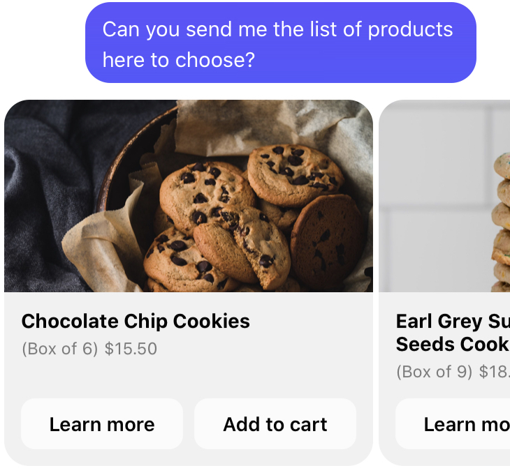

## Adding to Cart

### Deciphering Postbacks and Accessing Payload

Postbacks are buttons with a `payload`, and a **postback event** is triggered when users interact with postback buttons. In order to retrieve the content of a postback, we will access the `postback` attribute of the `webhook_event` object.

In the `postback` object, there are two attributes: `title` and `payload`, which are both defined in the **postback button** object. 

Here is an example:

```js
{ 
  title: 'Add to cart',
  payload: 'cart_add 1 123 Earl Grey Sunflower Seeds Cookies' 
}
```

To process the postback, the `webhook_event` handling needs to be modified in the POST request to the callback URL.

```js
let response = getDefaultResponse();
if (webhook_event['message']) {
  let message = webhook_event['message']['text'];
  console.log('Message received from sender ' + sender_psid + ' : ' + message);
  
  let nlp = webhook_event['message']['nlp'];
  response = processMessage(message, nlp);
} else if (webhook_event['postback']) {
  let payload = webhook_event['postback']['payload'];
  response = processPayload(payload);
}
```

### Processing the Postback Payload

Let us now define how the postback will be processed. We have formatted the add to cart postback string in this format: `cart_add <quantity> <product_id> <product_name>`

```js
function processPayload(payload) {
  let payload_parts = payload.split(' ');
  // console.log(payload_parts);
  let intent = payload_parts.shift();
  
  switch(intent) {
    case 'cart_add':
      // Example of payload: cart_add 1 123 Earl Grey Sunflower Seeds Cookies
      let quantity = payload_parts.shift();
      let pid = payload_parts.shift();
      let product_name = payload_parts.join(' ');
      
      // Update cart in database

      return getResponseFromMessage('Added ' + quantity + ' ' + product_name + ' to cart.');

    default:
      return getDefaultResponse();
  }

}
```


### Following Up with Quick Replies

One way to increase engagement is to utilise **quick replies**. Quick replies are buttons anchored right on top of the the textbox (composer) for users to type their message.

Let's try implementing it. First, replace

```js
return getResponseFromMessage('Added ' + quantity + ' ' + product_name + ' to cart.');
```

with

```js
return generateAddCartQuickRepliesResponse('Added ' + quantity + ' ' + product_name + ' to cart.');
```

The new `generateAddCartQuickRepliesResponse` function will create three buttons: **Checkout**, **View more products** and **View cart**. Quick replies, like postbacks, have a `payload` property. However, they are sent as `message` events instead of a `postback` events.

```js
function generateAddCartQuickRepliesResponse(message) {
  return {
    "text": message,
    "quick_replies": [
      {
        "content_type": "text",
        "title": "Checkout",
        "payload": "checkout"
      },
      {
        "content_type": "text",
        "title": "View more products",
        "payload": "recommendation"
      }, {
        "content_type": "text",
        "title": 'View cart',
        "payload": "cart_view"
      }
    ]
  }

}
```

Next, let us handle the quick reply payload in the POST endpoint of the callback URL.

```js
if (webhook_event['message']) {
  let message = webhook_event['message']['text'];
  console.log('Message received from sender ' + sender_psid + ' : ' + message);
  
  if (webhook_event['message']['quick_reply']) {
    payload = webhook_event['message']['quick_reply']['payload'];
    response = processPayload(payload);
  } else {
    let nlp = webhook_event['message']['nlp'];
    response = processMessage(message, nlp);
  }
} else if (webhook_event['postback']) {
  ...
```

Lastly, implement `recommendations` and `cart_view` intents in the `processPayload` function.

```js
case 'recommendation':
  // Get products from database
  
  return generateCarouselOfProductsResponse(products);
case 'cart_view':
  // Get cart from database

  return generateCartResponse(cart);
```

```js
function generateCartResponse(cart) {

  return {
    "attachment": {
      "type": "template",
      "payload": {
        "template_type": "generic",
        "elements":
        cart.map(p => {
          let subtitle = 'Qty: ' + p['quantity'] + ' ($' + p['price'].toFixed(2) + ' each)';
          if (p['pattern']) {
            subtitle = p['pattern'] + ', ' + subtitle;
          }

          return {
            title: p['title'],
            subtitle: subtitle,
            image_url: p['image_link'],
            buttons: [
              {
                type: "postback",
                title: "Add 1 to Cart",
                payload: `cart_add 1 ${p['pid']} ${p['title']}`
              }, 
              {
                type: "postback",
                title: `Remove All`,
                payload: `cart_remove_all ${p['pid']} ${p['title']}`
              }
            ]
          }
        })
      }
    }
  }

}
```

> For practice, try modifying how the `recommendation` intent is handled in `processPayload` by removing products that are in the user's cart!


## Checkout

### Mocking Payment with Button Template

Continuing the ordering process, the user eventually checks out his cart. The `payload` in the previous section introduced the `checkout` intent, which is implemented as follows:

```js
case 'checkout':
  // Get order from database

  // Add to order and delete cart

  return generateCheckoutResponse(order);
```

We then create a new `generateCheckoutResponse` function to take in an `order` to calculate the total amount, and ask for the user to pay with a **button template**.

```js
function generateCheckoutResponse(order) {
  let total_price = order.reduce((acc, p) => acc + p['price'] * p['quantity'], 0);

  return {
    attachment: {
      type: "template",
      payload: {
        template_type: "button",
        text: `Your order (including shipping) will be $${(total_price + 5).toFixed(2)}.\n\nYou will be contributing to ${Math.ceil(total_price / 5)} meals for our beneficiaries.`,
        buttons: [
          {
            type: "postback",
            title: "Proceed to pay",
            payload: "paid"
          }
        ]
      }
    }
  }
  
}
```

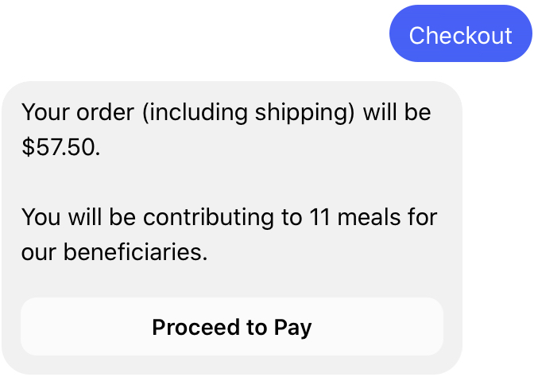

### Issuing a Receipt with the Receipt Template

After the user clicks/taps on **Proceed to pay**, a receipt will be generated with the **receipt template**, implemented with the `generateReceiptTemplate` function.

```js
case 'paid':
  // Get latest order from database

  return generateReceiptResponse(order);
```

```js
function generateReceiptResponse(order) {
  let total_price = order.reduce((acc, p) => acc + p['price'] * p['quantity'], 0);

  return {
    attachment: {
      type: "template",
      payload: {
        template_type: "receipt",
        recipient_name: "John Doe",
        order_number: "bf23ad46d123",
        currency: "SGD",
        payment_method: "PayPal",
        order_url: "",
        address: {
          street_1: "9 Straits View",
          city: "Singapore",
          postal_code: "018937",
          state: "SG",
          country: "SG"
        },
        summary: {
          subtotal: total_price.toFixed(2),
          shipping_cost: 5,
          total_tax: ((total_price+5)*0.07).toFixed(2),
          total_cost: (total_price+5).toFixed(2)
        },
        elements: order.map(product => {
          return {
            title: `${product["name"]}`,
            title: product["title"],
            subtitle: product["pattern"],
            quantity: product["quantity"],
            price: product["price"]*product["quantity"],
            currency: "SGD",
            image_url: product["image_link"]
          };
        })
      }
    }
  };
}
```

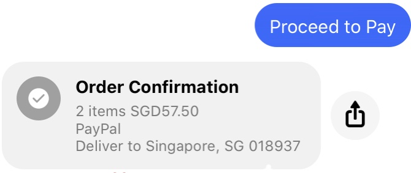

When clicked, the receipt expands:

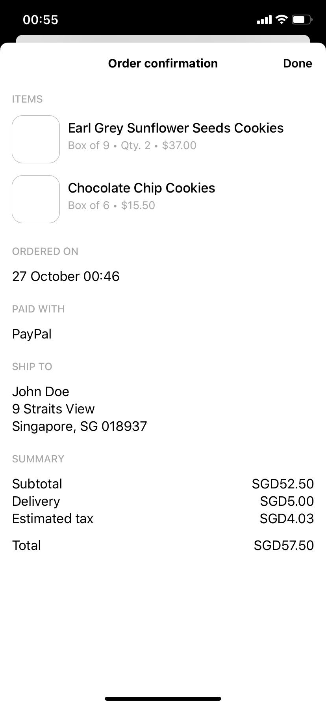

## Challenge 1: Order Enquiry

In the previous section - [Checkout](#checkout) - we created orders for fulfillment. Now, extend the chatbot's functionality by implementing order enquiry in the chatbot, which allows users to enquire on their order status.

> Hint: Train some utterances with a new intent (say, `enquiry_order`) and process the message. Then utilise the button template or quick replies to allow users to select the order that they are enquiring.

## Challenge 2: Implement Product Enquiries

In the [Introduction to Templates](#introduction-to-templates) section, each generic template element in the carousel has a "Learn more" button that has the payload `enquiry_product <product_name>`. For example, a user can enquire about the number of cookies in a box, or the number of variants a product has.

Implement the `enquiry_product` intent in the `processPayload` function. You might need to collect enough details of the product that the user is enquiring in order to provide an answer.

> Hint: One way to do so is to keep adding onto the payload (e.g. `enquiry_product <product_name> <product_variant> <attribute>`). Or, you could also store the postback parts in the database as a new collection/table.

## Wrapping Up

## Acknowledgements

Special shoutout to Douglas Sim and Jelissa Ong, who helped to build the Bright Social Enterprise Commerce Bot in the previous Messenger hackathon, and agreeing to allow us to use Bright chatbot as a solution for this hackathon!

## References

- Postback Button: https://developers.facebook.com/docs/messenger-platform/reference/buttons/postback
- Quick Replies: https://developers.facebook.com/docs/messenger-platform/send-messages/quick-replies/
- Send API: https://developers.facebook.com/docs/messenger-platform/reference/send-api/
- Send Messages: https://developers.facebook.com/docs/messenger-platform/send-messages/
