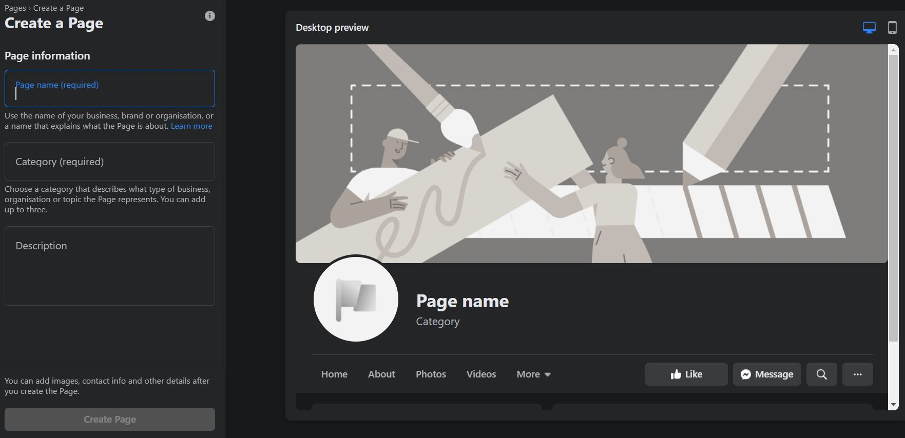
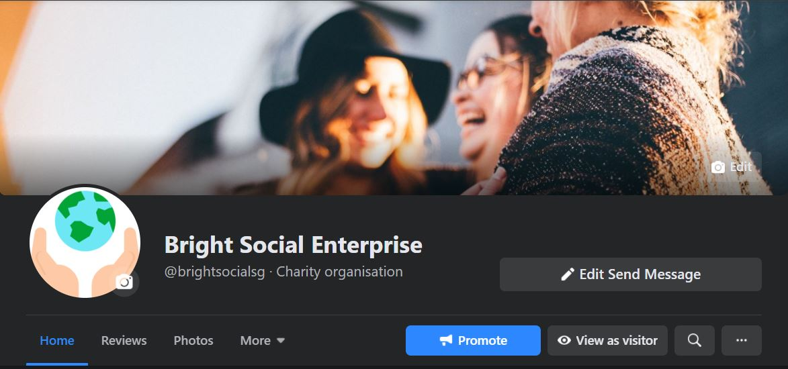

# Learn to Create Messenger Experiences with Bright: E-Commence Chatbot

## Introduction

## Pre-Requisites

The following subsections list the background knowledge and how to get started prior to creating a chatbot.

### JavaScript Knowledge

### Facebook Page
Creating a Facebook Page is a key step in your journey to creating a messager experience. Here are a few simple steps to help you get started:

1. Go to facebook.com/pages/create - it should lead you to a page shown below



2. Fill in your page information
3. Add images - adding a profile and cover image is important to allow others to identify your business

Congratulations! You have done the setup of your Facebook Business Page! Next is on how to create a Messenger Bot for your page!

### Optional: Add a “Send Message” Button
After creating your very own Facebook Page for your business, you will want a way to communicate with your customers. Before even going into the details on how to create a chatbot, what better way than to direct users to send messages to you when they visit your page?

This button should be found at the top of your page. Click on **Add a Button** and select the **Send Message** option.



### Optional: Create a Greeting

Customize your personal message to your customers when they first start communicating with your page through Messenger. So how do we go about doing it?

1. Go to your page’s General Settings and select **Messaging**
2. Scroll down and turn on **Show a greeting**
3. Customise your greeting and click **Change**

### Optional: Create Frequently Asked Questions and Responses

Create a set of creative responses for frequently asked questions regarding your business. This is highly recommended before creating your chatbot as it helps you brainstorm and implement various prompts for users to start interacting with your page on Messenger.

Here is how you can do it:

1. Under Manage Page, select **Inbox**
2. In the left menu sidebar, select **Automated Responses**
3. Enable **Frequently Asked Questions**
4. Click **Edit**
5. Add questions and responses (remember to save your responses with the **Save** button on the top right!)

### Connect your Webhook onto your Facebook for Developers App

These are the important few steps to getting started before you can develop your chatbot to serve your users using code.

#### Create an App on Facebook for Developers

#### Create the Webhook

Webhooks are API endpoints which you expose, to allow client(s) to connect to. This allows the users to interact to either send data or collect data from your servers. In this case, we are using this endpoint as an interaction between your webhook and your Facebook for Developers App, to send and receive data from our chatbot on your Facebook business page. 

To begin, first create `index.js` with the following code:

```
'use strict';
 
// Imports dependencies and set up http server
const
  express = require('express'),
  bodyParser = require('body-parser'),
  app = express().use(bodyParser.json()), // creates express http server
  dotenv = require('dotenv');

dotenv.config();
 
// Sets server port and logs message on success
const listener = app.listen(process.env.PORT || 1337, () => console.log('webhook is listening on port ' + listener.address().port));
 
app.get('/', (req, res) => {
  res.status(200).send('You are connected to the chatbot application.');
})
```

Let us now create a `GET` request `/webhook` endpoint for your Facebook for Developers App to verify the webhook. We suggest adding your verification token in a `.env` file.

```
// Adds support for GET requests to our webhook
app.get('/webhook', (req, res) => {
  
  // Your verify token. Should be a string you set.
  let VERIFY_TOKEN = process.env.VERIFY_TOKEN;
  
  // Parse the query params
  let mode = req.query['hub.mode'];
  let token = req.query['hub.verify_token'];
  let challenge = req.query['hub.challenge'];
  
  // Checks if a token and mode is in the query string of the request
  if (mode && token) {
    
    // Checks the mode and token sent is correct
    if (mode === 'subscribe' && token === VERIFY_TOKEN) {
      
      // Responds with the challenge token from the request
      console.log('WEBHOOK_VERIFIED');
      res.status(200).send(challenge);
      
    } else {
      // Responds with '403 Forbidden' if verify tokens do not match
      res.sendStatus(403);      
    }
  }
});
```

#### Link the Webhook with your Facebook for Developers App

So how can you connect with Facebook? 

1. Go to your Application that you have created earlier in https://developers.facebook.com
2. Select **Messenger** and click **Settings**
3. Insert your server’s **Callback URL**, followed by `/webhook`. In this tutorial the webhook endpoint is `https://<url>/webhook`. Note here that the URL has to be served with HTTPS, or else you would not be able to connect to Facebook

Note that the verify token is like a shared secret that Facebook has between you and your application for them to authenticate the connection to the callback URL. 

This is how it looks like if you have successfully added the webhook callback URL:


There you have it, you have successfully connected your chatbot application with Facebook!

## Receiving Messages

## Sending Messages

Sending messages require the use of Send API via a post request coupled with your page access token included in your URL query string.

Below is a wrapper function that takes in the sender’s identifier (called Page-scoped ID, or PSID in short) and the response object. This function converts parameters into the standardised data structure and proceeds to send the response.

```
// Sends response messages via the Send API
function callSendAPI(sender_psid, response) {
 
  // Construct the message body
  let request_body = {
      messaging_type: 'RESPONSE',
      recipient: {
          id: sender_psid
      },
      message: response
  };
 
  // Send the HTTP request to the Messenger Platform
  request(
      {
        uri: "https://graph.facebook.com/v8.0/me/messages",
        qs: { access_token: process.env.PAGE_ACCESS_TOKEN },
        method: "POST",
        json: request_body
      },
      (err, res, body) => {
          if (!err) {
              console.log("Message sent!");
          } else {
              console.error("Unable to send message: " + err);
          }
      }
  );
}
```

In the `request_body`, the recipient’s ID is the sender of the messenger, which can be referenced by the PSID. This allows us to specify which user the message response is for, and for the Messenger Platform to route to the right user. The message attribute in the request_body simply refers to the response of the message that you will like to send back.

In order to make a HTTP request to the Messenger Platform, we will use the request package. More information on that package can be found here: https://www.npmjs.com/package/request.

The request object takes in 
- `uri`: The URI of the Send API
- `qs`: Query string parameters that will be attached to the URL
- `PAGE_ACCESS_TOKEN`
- `json`: Request body JSON that you had created

To get the `PAGE_ACCESS_TOKEN`, navigate to your App on Facebook for Developers. Under **Access Tokens**, click **Add or Remove Pages**. Add your page and click **Generate Token**. Read and check **I Understand**, then create a `.env` file and paste the token.

Your `.env` file should now look like this:
```
PAGE_ACCESS_TOKEN=<page_access_token>
VERIFY_TOKEN=<verify_token>
```

Create a `.gitignore` and add `.env` inside (if you have not). Also, add the variables to [Heroku](https://devcenter.heroku.com/articles/config-vars).  In our script, we the `dotenv` package is used to configure and retrieve the page access token. 

The start of your `index.js` should look like this (remember to add the new dependencies in `package.json` too):
```
// Imports dependencies and set up http server
const
  express = require('express'),
  bodyParser = require('body-parser'),
  app = express().use(bodyParser.json()), // creates express http server
  dotenv = require('dotenv'),
  request = require('request');
 
dotenv.config();
```

Once all these components are in place, you’re ready to execute standard responses back to the sender. Let us try automating some standard responses!

We first define a wrapper function `sendMessage` that takes in `sender_psid` and `message` (of string type), converts the string to a response object, then sends the message. This function might seem unnecessary now, but is definitely useful when the scale of the chatbot gets larger.

```
// Wrapper method to convert text message string to response object, and sends the message
function sendMessage(sender_psid, message) {
  const response = {
      text: message
  };
  
  callSendAPI(sender_psid, response);
}
```

### Sending Back the Same Message
We will first start by responding to the same message as what the user sent.

```
// Creates the endpoint for our webhook 
app.post('/webhook', (req, res) => {  
  
  let body = req.body;
  
  // Checks this is an event from a page subscription
  if (body.object === 'page') {
    
    // Iterates over each entry - there may be multiple if batched
    body.entry.forEach(function(entry) {
      
      // Gets the message. entry.messaging is an array, but 
      // will only ever contain one message, so we get index 0
      let webhook_event = entry.messaging[0];
      let sender_psid = webhook_event['sender']['id'];
      let message = webhook_event['message']['text'];
      console.log('Message received from sender ' + sender_psid + ' : ' + message);
      
      sendMessage(sender_psid, message);
    });
    
    // Returns a '200 OK' response to all requests
    res.status(200).send('EVENT_RECEIVED');
  } else {
    // Returns a '404 Not Found' if event is not from a page subscription
    res.sendStatus(404);
  }
  
});
```

Try it out! You should see the following behaviour:


### Sending Standard Responses

Now let us implement some standard reponses. First, replace `sendMessage` with a new `processMessage` function that will be implemented later.

The `processMessage` function encapsulates the implementation of the standard responses.

```
// Processes and sends text message
function processMessage(sender_psid, message) {
  
  message = message.toLowerCase();

  let responses = {
    hi: "Hi there! Welcome to Bright. How can I help you?",
    bright: "Bright is a social enterprise where we provide vocational training to adults with intellectual disabilities.\n\n" +
        "We started a range of social enterprise projects to provide alternative work engagement opportunities for our adult trainees. " + 
        "Some of the projects began as therapy programmes which encourage the development of fine motor skills; others provide a realistic vocational training environment.\n\n" +
        "All net revenue earned from the sale of our products and services go towards paying a monthly allowance for our clients' work, as well as their lunch expenses while undergoing training.",
    proceeds:
        "All net revenue earned from the sale of our products and services go towards paying a monthly allowance for our clients' work, as well as their lunch expenses while undergoing training.",
    support:
        "We support adults with intellectual disabilities. We started a range of social enterprise projects to provide alternative work engagement for our adult trainees.",
    sell: "We sell craft and baker goods.\nLike our Facebook page http://fb.me/brightsocialsg to stay updated!",
    safe: "Our cookies are made by our clients in a clean and sanitised environment. The cookies are safe to consume before the expiry date that is printed on the packaging."
  };

  for (const key in responses) {
    if (message.includes(key)) {
      sendMessage(sender_psid, responses[key]);
      break;
    }
  }

  // Message does not match any keyword, send default response
  sendMessage(sender_psid, "We could not understand your message. Kindly rephrase your message and send us again.");

}
```

Now, whenever your message includes any of those keywords in the `responses` object, a standard response message will be sent.

## Introduction to `Wit.ai` Natural Language Processing (NLP)